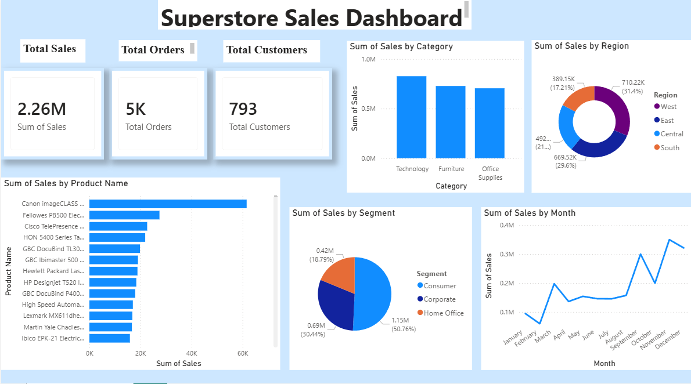

# Superstore Sales Dashboard

# Project Overview

This project is an interactive Power BI dashboard created using Superstore sales data.
The dashboard provides useful business insights through visual reports and KPI metrics.

# Tools & Technologies

- Power BI
- Excel / CSV
- DAX
- VS Code
- GitHub

# Features

- Total Sales Analysis
- Total Orders Analysis
- Customer Insights
- Sales by Category
- Monthly Sales Trend
- Region-wise Sales Analysis
- Segment-wise Sales Distribution
- Top Selling Products

# Dashboard Insights

- Technology category generated the highest sales.
- Consumer segment contributed the highest share of sales.
- Sales increased during the final months.
- Top-selling products generated major revenue.

# Dashboard Preview

# Files Included

- Cleaned Dataset (.csv)
- Power BI Dashboard (.pbix)
- Dashboard Screenshot
- Business Insights File
- SQL Analysis File

# Project Outcome

This project improved my skills in:

- Data Cleaning
- Data Visualization
- Dashboard Design
- Business Analysis
- Power BI Reporting

# Author

Nikitha